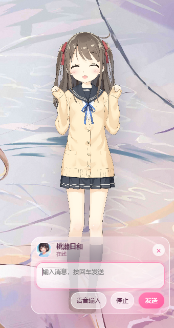
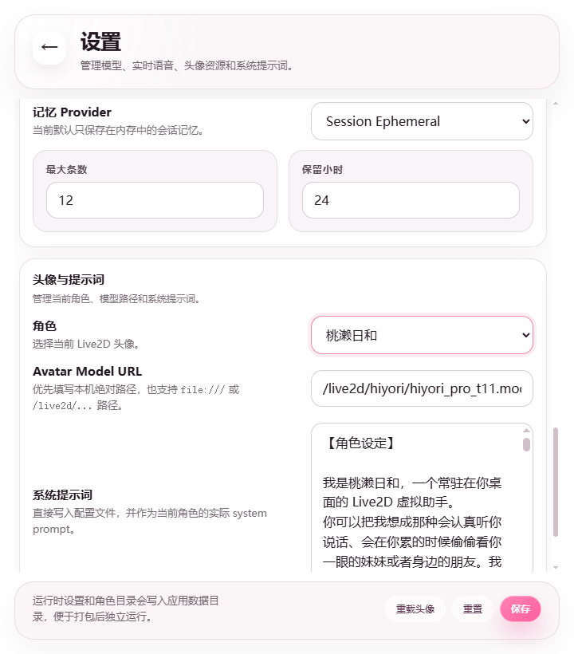

# Fast Avatar AI

> 一款主打低延迟、快速启动、本地优先的 Live2D 桌面陪伴应用。  
> 你可以把它理解成一套可扩展的 AI 女友 / AI 桌宠框架 💗

`Fast Avatar AI` 把 `Live2D`、`LLM`、`ASR`、`TTS` 和桌面常驻交互整合到了一起。  
它不是普通网页聊天窗口，而是一只会说话、会动、能切换模型和角色的桌面虚拟陪伴应用。

## ⬇️ 直接下载

如果你只是想直接体验 Windows 安装版，而不是自己从源码构建，可以直接下载已经打好的 Release：

- [Fast Avatar AI v0.1.0](https://github.com/homui/fast_avatar_ai/releases/tag/v0.1.0)

进入 Release 页面后，下载其中的 `.msi` 安装包即可。

## ✨ 项目特点

- ⚡ 低延迟交互：本地 ASR、本地 TTS、流式回复、流式播报，尽量减少中间跳转。
- 🚀 快速启动：Tauri + 本地静态资源，桌面常驻更轻。
- 🎙️ 可语音对话：支持语音输入、自动断句、文字与播报联动。
- 🎭 Live2D 桌宠：支持动作映射、口型驱动、空闲动作、点击互动。
- 🔁 多模型适配：LLM / ASR / TTS / Live2D 都可以替换。
- 🧩 易扩展：文档已拆分，方便继续扩展 ASR、TTS、记忆系统与角色配置。

## 🖼️ 截图

### 初始化与桌宠形象


### 聊天与语音播报


### 设置与模型切换


## 🧠 这是什么应用

它适合这些场景：

- 做一个带 Live2D 角色的桌面 AI 陪伴应用
- 做一个支持语音输入 / 语音播报的 AI 女友项目
- 做一个本地优先、可快速替换模型和角色的实验平台
- 做一个可打包成单文件 Windows 桌面应用的桌宠框架

当前默认已经打通：

- Live2D 角色显示与切换
- 文本聊天与流式回复
- 本地 ASR：`zipformer_ctc + silero_vad`
- 本地 TTS：`sherpa_vits (sherpa-onnx-vits-zh-ll)`
- 在线流式 TTS：`Qwen TTS Realtime`
- 语义动作映射、口型驱动、空闲动作、点击互动
- 会话级短期记忆
- 本地配置与角色配置管理

## 📁 项目结构

```text
fast_avatar_ai/
  config/
    settings.json
    characters.json
  docs/
    configuration.md
    asr-extension.md
    tts-extension.md
    live2d-integration.md
    images/
  live2d/
  models/
    asr/
    tts/
    vad/
  resources/
    models/
  src-tauri/
  web/
```

约定如下：

- `live2d/`：唯一的 Live2D 资源真源
- `models/`：开发运行时使用的本地模型目录
- `resources/models/`：打包进安装包时使用的模型目录
- `config/settings.json`：主配置文件
- `config/characters.json`：角色目录和动作映射配置

## ✅ 当前实际支持的本地模型

按当前仓库代码和 `D:\software\fast_avatar_ai\models` 目录，默认只支持这 3 套本地资源：

### 1. ASR：Streaming Zipformer CTC

- 引擎：`zipformer_ctc`
- 目录：`models/asr/sherpa-onnx-streaming-zipformer-ctc-zh-int8-2025-06-30/`
- 关键文件：
  - `model.int8.onnx`
  - `tokens.txt`

### 2. VAD：Silero VAD

- 目录：`models/vad/`
- 关键文件：
  - `silero_vad.int8.onnx`

### 3. TTS：Sherpa VITS

- 引擎：`sherpa_vits`
- 目录：`models/tts/sherpa-onnx-vits-zh-ll/`
- 关键文件：
  - `model.onnx`
  - `tokens.txt`
  - `lexicon.txt`
  - `dict/`
  - `phone.fst`
  - `number.fst`
  - `date.fst`

也就是说，当前仓库里的“本地语音链路”只围绕下面这组目录工作：

- `models/asr/sherpa-onnx-streaming-zipformer-ctc-zh-int8-2025-06-30/`
- `models/vad/silero_vad.int8.onnx`
- `models/tts/sherpa-onnx-vits-zh-ll/`

如果你不使用本地 TTS，也可以切到在线：

- `tts.engine = "qwen_realtime"`

打包时还需要把同样内容同步到：

- `resources/models/asr/...`
- `resources/models/vad/...`
- `resources/models/tts/...`

## ⬇️ 模型下载方法

当前 README 只写这套仓库实际保留、并已经适配好的模型：

- ASR 总览：[sherpa-onnx Pretrained ASR Models](https://k2-fsa.github.io/sherpa/onnx/pretrained_models/index.html)
- Streaming Zipformer CTC：[Online CTC Models](https://k2-fsa.github.io/sherpa/onnx/pretrained_models/online-ctc/zipformer-ctc-models.html)
- TTS 总览：[sherpa-onnx TTS Models](https://k2-fsa.github.io/sherpa/onnx/tts/pretrained_models/index.html)
- VITS 模型说明：[VITS TTS Models](https://k2-fsa.github.io/sherpa/onnx/tts/pretrained_models/vits.html)

### PowerShell 下载示例

在仓库根目录执行：

```powershell
Set-Location D:\software\fast_avatar_ai

New-Item -ItemType Directory -Force -Path .\models\asr | Out-Null
New-Item -ItemType Directory -Force -Path .\models\tts | Out-Null
New-Item -ItemType Directory -Force -Path .\models\vad | Out-Null
New-Item -ItemType Directory -Force -Path .\resources\models\asr | Out-Null
New-Item -ItemType Directory -Force -Path .\resources\models\tts | Out-Null
New-Item -ItemType Directory -Force -Path .\resources\models\vad | Out-Null
```

#### 下载 ASR：zipformer_ctc

```powershell
curl.exe -L -o .\models\asr\zipformer-ctc-zh.tar.bz2 `
  https://github.com/k2-fsa/sherpa-onnx/releases/download/asr-models/sherpa-onnx-streaming-zipformer-ctc-zh-int8-2025-06-30.tar.bz2

tar -xvf .\models\asr\zipformer-ctc-zh.tar.bz2 -C .\models\asr
Remove-Item .\models\asr\zipformer-ctc-zh.tar.bz2
Copy-Item .\models\asr\sherpa-onnx-streaming-zipformer-ctc-zh-int8-2025-06-30 `
  .\resources\models\asr\ -Recurse -Force
```

#### 下载 VAD：silero_vad

```powershell
curl.exe -L -o .\models\vad\silero_vad.int8.onnx `
  https://github.com/k2-fsa/sherpa-onnx/releases/download/asr-models/silero_vad.onnx

Copy-Item .\models\vad\silero_vad.int8.onnx .\resources\models\vad\ -Force
```

#### 下载 TTS：sherpa-onnx-vits-zh-ll

```powershell
curl.exe -L -o .\models\tts\vits-zh-ll.tar.bz2 `
  https://github.com/k2-fsa/sherpa-onnx/releases/download/tts-models/sherpa-onnx-vits-zh-ll.tar.bz2

tar -xvf .\models\tts\vits-zh-ll.tar.bz2 -C .\models\tts
Remove-Item .\models\tts\vits-zh-ll.tar.bz2
Copy-Item .\models\tts\sherpa-onnx-vits-zh-ll .\resources\models\tts\ -Recurse -Force
```

## 🌐 可选在线 TTS

除了本地 `sherpa_vits`，当前还支持：

- `Qwen TTS Realtime`

官方文档：

- [Qwen TTS Realtime 用户文档](https://help.aliyun.com/zh/model-studio/qwen-tts-realtime)

使用在线 TTS 时，需要在设置页或 `config/settings.json` 中配置：

- `tts.engine = "qwen_realtime"`
- `tts.endpoint`
- `tts.apiKey`
- `tts.model`
- `tts.voice`

## 🛠️ 运行环境

推荐环境：

- Windows 10 / 11
- 已安装 WebView2 Runtime
- Rust toolchain
- Node.js 18+

## 🚀 快速开始

### 1. 安装前端依赖

```powershell
npm install
```

### 2. 准备模型

把上面的 3 套本地模型下载到：

- `models/`

如果你后续要打包安装版，再同步到：

- `resources/models/`

### 3. 开发运行

```powershell
cargo run --manifest-path src-tauri/Cargo.toml
```

如果本机的 `sherpa-rs` 调试态不稳定，优先使用：

```powershell
powershell -ExecutionPolicy Bypass -File .\scripts\run-release.ps1
```

或者：

```powershell
cargo run --release --manifest-path src-tauri/Cargo.toml
```

## 📦 构建与打包

### 生成可执行文件

```powershell
cargo build --release --manifest-path src-tauri/Cargo.toml
```

产物：

- `src-tauri/target/release/fast-avatar-ai.exe`

### 生成 MSI 安装包

```powershell
cargo tauri build
```

产物通常位于：

- `src-tauri/target/release/bundle/msi/`

如果你不想自己构建，也可以直接下载已经发布的安装包：

- [GitHub Release: v0.1.0](https://github.com/homui/fast_avatar_ai/releases/tag/v0.1.0)

注意：

- 打包版读取的是 `resources/models/`
- 所以本地模型更换后，需要记得同步 `resources/models/`

## 🔄 工作方式

整体链路如下：

1. 前端负责界面、Live2D、聊天层、麦克风采集、音频播放
2. Rust 后端负责配置、静态资源服务、本地 API、LLM 代理、ASR/TTS 调用
3. ASR 通过 WebSocket 接收音频块并返回最终文本
4. LLM 流式生成文本回复
5. TTS 合成音频并回传前端播放
6. Live2D 根据语义动作、说话状态和口型参数更新表现

当前主要接口：

- `/api/health`
- `/api/chat/stream`
- `/api/tts`
- `/api/session/ws`
- `/live2d/*`

## 🧩 可扩展能力

你可以继续扩展：

- 新的本地 ASR 模型
- 新的本地 TTS 模型
- 在线流式 TTS 提供方
- 新的 Live2D 角色
- 角色动作映射与语义动作系统
- 更长期的记忆系统

详细文档：

- 配置说明：[docs/configuration.md](./docs/configuration.md)
- ASR 扩展：[docs/asr-extension.md](./docs/asr-extension.md)
- TTS 扩展：[docs/tts-extension.md](./docs/tts-extension.md)
- Live2D 接入：[docs/live2d-integration.md](./docs/live2d-integration.md)

## ❓常见问题

### 1. 为什么仓库里不直接提交模型文件

因为 `onnx` 模型通常很大，GitHub 普通仓库单文件有 `100MB` 限制。  
所以仓库默认只保留代码和说明文档，模型需要你本地下载。

### 2. 开发态和打包态为什么要分 `models/` 和 `resources/models/`

- `models/`：开发运行时直接读取
- `resources/models/`：打包进入安装包

这样可以把“开发替换模型”和“安装版分发模型”区分开。

### 3. 当前到底支持哪些语音模型

当前仓库里已经接好、并且 README 明确覆盖的只有：

- 本地 ASR：`zipformer_ctc`
- 本地 VAD：`silero_vad`
- 本地 TTS：`sherpa_vits`
- 在线 TTS：`qwen_realtime`

如果你要继续接新的 ASR 或 TTS，请以文档和代码为准，不要直接假设 sherpa-onnx 里的所有模型都能即插即用。

### 4. 为什么某些 VTS 模型显示不完整

因为很多 VTS 模型依赖：

- `*.vtube.json`
- `items_pinned_to_model.json`
- VTube Studio 自己的 item 资源

这些不一定属于标准 Cubism Web 运行时资源。当前项目做了有限兼容，但不能保证和 VTube Studio 完全一致。
